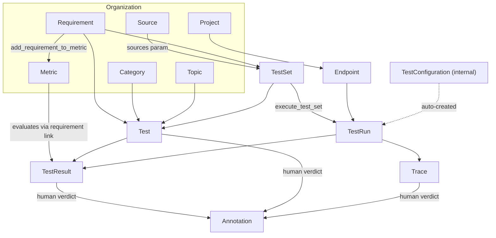

# Rhesis Platform Entity Model

How platform entities relate to each other and which MCP tools operate on them.

> When `mcp_tools.yaml` changes, keep this file and `tool-catalog.md` in sync.

---

## Entity graph

---

## Key relations

| Relation | Meaning | Tools |
|----------|---------|-------|
| Requirement ↔ Metric | Many-to-many; **required before test generation** | `add_requirement_to_metric`, `get_metric_requirements`, `remove_requirement_from_metric` |
| TestSet → Test | Tests belong to a set | `generate_test_set`, `list_test_set_tests`, `get_test_set` |
| TestResult ↔ Annotation | A human Pass/Fail **overrides** the automated status, so the run's reported outcome changes with it | `list_annotations`, `create_annotation` |
| Trace ↔ Annotation | Traces carry annotations too, at trace, metric or turn level. An annotation on a Trace records the **span's row id**, not the hex `trace_id` — `lookup_span` turns it back into a trace | `list_annotations`, `create_annotation`, `lookup_span` |
| TestRun → Trace | One trace per test execution: what the application did to produce each result | `list_traces` with `test_run_id`, `get_trace` |
| Trace → Span | A trace is a tree of spans — the LLM calls, retrievals and tool invocations inside one request | `get_trace`, `list_traces` with `root_spans_only=false` |
| Source → TestSet | Sources ground **Single-Turn** generation only | `list_sources`, `create_source` → `generate_test_set` |
| TestSet + Endpoint → TestRun | Execution is always a pair | `execute_test_set` |
| TestRun → TestResult | Results scoped to a run | `list_test_results` with `$filter=test_run_id eq '…'` |
| Metric → TestResult | Scores when metric is linked to the test's requirement | `get_test_result`, `get_insights` with `entity=metric` |

**Resolution pattern:** `list_*` + `$filter` by name → use `id` in `get_*` / mutate / execute tools.

---

## Tool chains by intent

### Register and explore an endpoint

1. `list_projects` (if creating new endpoint)
2. `create_endpoint` → `check_endpoint`
3. `explore_endpoint` → `get_job_status` until SUCCESS

### Ground tests in documentation

1. `list_sources` with `$filter=contains(tolower(title), 'keyword')`
2. If no match: `create_source` (Manual + `content`, or Website + `url`)
3. `generate_test_set` with `sources: [{"id": "<uuid>"}]` (Single-Turn only)

### Create a full test suite

1. `list_requirements`, `list_metrics` (reuse check)
2. `create_requirement` (new requirements only)
3. `create_metric` or reuse existing
4. `add_requirement_to_metric` for every mapping (**all must complete before step 5**)
5. `generate_test_set` → `get_job_status` → `get_test_set` + `list_test_set_tests` (verify)
6. Offer `execute_test_set`

### Run and analyze

1. `get_test_set_metrics` (optional pre-flight)
2. `execute_test_set` (test_set_identifier + endpoint_id)
3. `get_test_run` (accurate totals)
4. `get_insights` with `entity=test_result`, `group_by=[requirement]` and `test_run_ids`; again with `entity=metric`, `group_by=[metric_name]`
5. `list_test_results` filtered to failures
6. `get_test_result` on top 2–3 failures (read `reason` field)

### See what the application actually did

1. `list_traces` with `test_run_id` (add `status_code=ERROR` and `root_spans_only=false` to land on the failing span, or `duration_min_ms` + `sort_by=duration_ms` for the slow ones)
2. `get_trace` with that row's `trace_id` **and** `project_id` — both required
3. Read the span tree: the `ERROR` span, or the one whose `duration_ms` dominates, is the answer
4. `get_trace_metrics` for what the run cost and its latency percentiles

### Compare with previous run

1. `get_test_set_last_run` with test set + endpoint IDs
2. `get_insights` with `entity=test_result`, `group_by=[test_run,test_run_id]` and both `test_run_ids`

### Fix a single test prompt

1. `list_test_set_tests` → pick test id
2. `get_test` → `update_test` with revised prompt

### Fix a metric

1. `list_metrics` → resolve by name
2. `get_metric` (read `evaluation_prompt` and thresholds)
3. `update_metric` for precise field edits, OR `improve_metric` for NL instructions
4. `get_metric_requirements` to confirm requirement links

### Undo a requirement–metric link

1. `get_metric_requirements`
2. `remove_requirement_from_metric`

---

## Entity → tools quick reference

| Entity | List | Get | Create | Update | Other |
|--------|------|-----|--------|--------|-------|
| Project | `list_projects` | `get_project` | `create_project` | — | — |
| Endpoint | `list_endpoints` | `get_endpoint` | `create_endpoint` | `update_endpoint` | `check_endpoint`, `explore_endpoint` |
| Requirement | `list_requirements` | `get_requirement` | `create_requirement` | `update_requirement` | — |
| Metric | `list_metrics` | `get_metric` | `create_metric`, `generate_metric` | `update_metric`, `improve_metric` | `add_requirement_to_metric`, `remove_requirement_from_metric`, `get_metric_requirements` |
| TestSet | `list_test_sets` | `get_test_set` | `generate_test_set`, `create_test_set_bulk` | `update_test_set` | `list_test_set_tests`, `get_test_set_metrics`, `get_test_set_last_run`, `execute_test_set` |
| Test | `list_tests`, `list_test_set_tests` | `get_test` | (via test set tools) | `update_test` | — |
| Source | `list_sources` | — | `create_source` | — | — |
| TestRun | `list_test_runs` | `get_test_run` | (via `execute_test_set`) | — | `get_insights` with `entity=test_run` (volume, status, who ran what) |
| TestResult | `list_test_results` | `get_test_result` | — | — | `get_insights` with `entity=test_result` (pass rates, comparisons) |
| Annotation | `list_annotations` | `get_annotation` | `create_annotation` | `update_annotation` | — |
| Trace | `list_traces` | `get_trace` | (by instrumentation only) | — | `get_trace_metrics` (cost, tokens, latency), `lookup_span` (row id → trace), `list_trace_providers` (values for the `provider` filter) |
| Status | `list_statuses` | — | — | — | Carries the verdict a `create_annotation` records; look the id up, never guess it |
